Purpose:

This program developed a hit pattern recognitions for table tennis players
utilizing the video stream of them. The skeleton data of their limbs and arms
are extracted from the Openpose program out of the vision sensor. These data are
expressed as npy files out of the joints of human bodies as function of time
series during the exercise period. The goal of this code is to train these data
for efficient stroke style recognition given a short period of sampling on the
athlete’s exercise video. Among the 25 joints of a human body, this code
explores the various combination of joints and optimize the LSTM training errors
from these selected attribute/features. It tries to generate a selected set of
joints that will differentiate two different motion patterns with the largest
deviation in the table tennis stroke: forehand top spin and backhand top spin.

The input to the program is as follows:

1.  The original data from Openpose program on motion video of table tennis
    players into n\*50 size matrix.

[[1,1,1,1,…………………,1,1],

[2,2,2,2,…………………,2,2],

.

.

[n,n,n,n,…………………,n,n]

]

And then store into different npy files.

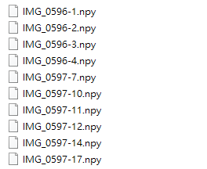

Then store these files into different directories for training and testing
purposes for forehand and backhand strokes. They are back hand training、back
hand testing、forehand training and forehand testing.

There are 2 ga-lstm files in the repository.

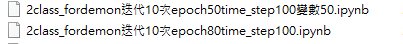

And 1 epoch80 model file

The setting of the above is

1\. 2class_fordemon iterates 10 times epoch50time_step100 variable 50.ipynb

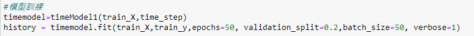

2\. 2class_fordemon iterates 10 times epoch80time_step100.ipynb

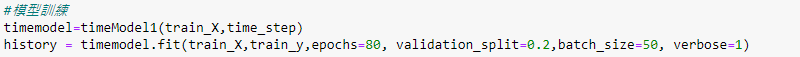

The difference between the two is 50 for the upper epoch and 80 for the lower
epoch.

Read the forehand training and backhand training at the beginning of the process

Then the array is generated by the ga algorithm

The following is divided into 2 parts 1 is 50, 2 is 80

epoch50

After reading, delete according to the array generated by ga

The final result is

11100111010001000001100000001110001101101011010011

There are 23 1s and 27 0s, where 0 is to remove the column, and 1 is to keep the
column

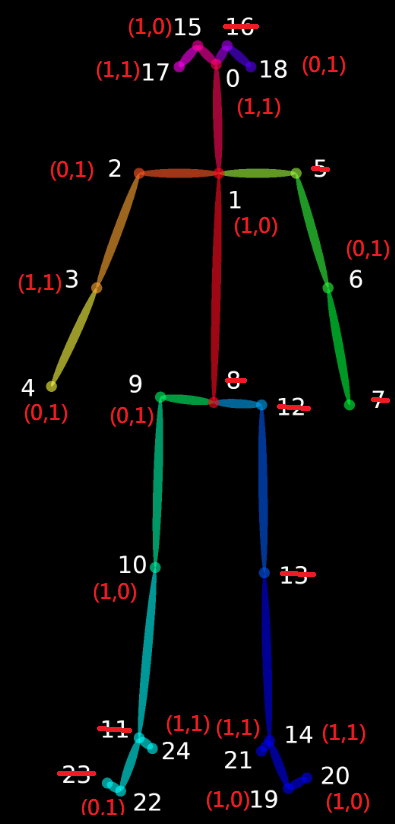

Then read the forehand test and backhand test folder

And the original data is processed according to the above genes

Make it a matrix of size n\*23

Let’s fix its size n to 120

At this time the matrix is ​​120\*23

Let’s perform a one-dimensional action on it.

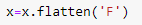

Make it 1\*2760

Then put it into data to form a 2-dimensional matrix

Next, make another adjustment, because time_step is set to 100, so change it to
n\*100\*2760 size and put it into LSTM for training

The following is the training curve during training

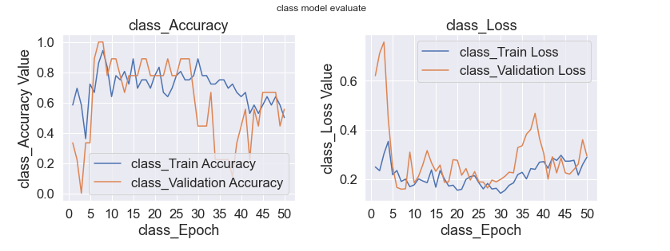

The following is the result of the test, where 0 is forehand and 1 is backhand

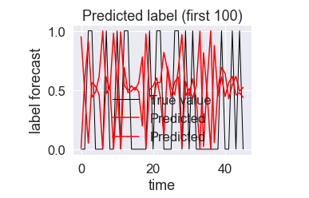

2.epoch80

After reading the array generated by GA algorithm as follows:

11010001111101111011101111000001001110100111001010

There are a total of 29 1’s and 21 0’s. The 0’s are deleted from the skeleton
display below.

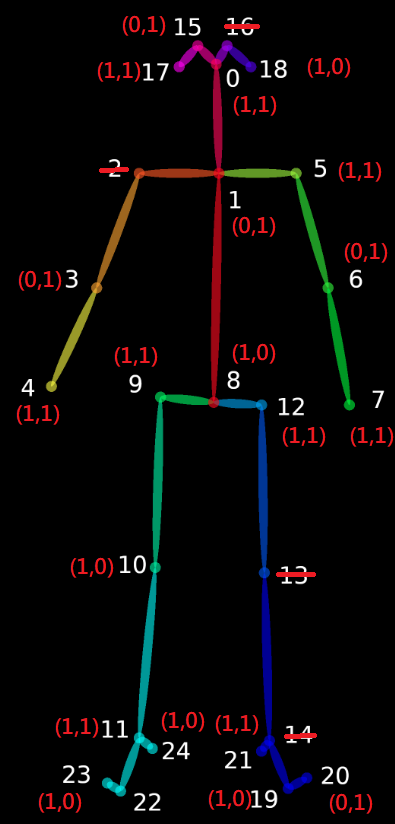

Then we read the forehand test and backhand test

Then reduce the array size by turning it into a matrix of size n\*29

Let’s fix its size n to 120. This time, the matrix is ​​120\*29

Let’s perform a one-dimensional action on it.

Make it 1\*3480

Then put it into data to form a 2-dimensional matrix

Next, make another adjustment, because time_step is set to 100, so change it to
n\*100\*3480 size and put it into LSTM for training

The following is the training curve during training process.

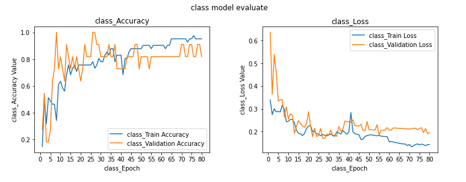

The following is the test result, 0 means forehand, and 1 is for backhand.

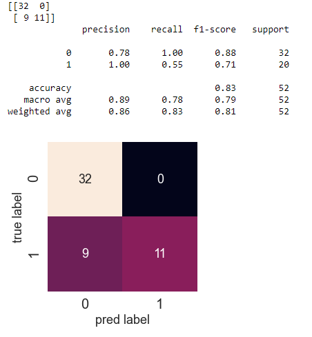

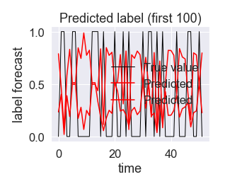
